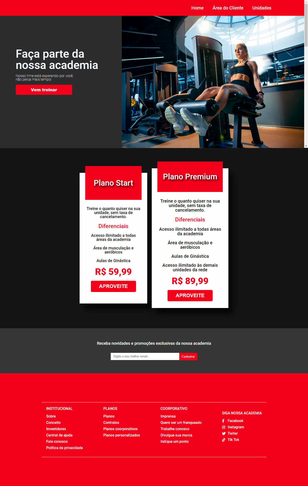

  <a href="https://github.com/andersonDias89" target="_blank"></img src="https://img.shields.io/badge/GitHub-100000?style=for-the-badge&logo=github&logoColor=white" target="_blank"></a>

<h1>Página simples para academia</h1>

<h2>Descrição</h2>

Esse projeto foi mais um para por em prática o meu aprendizado. 
De inicio é só uma página estática de uma certa academia. 
Pretendo deixar esse projeto um site dinâmico, com login do cliente, página exclusiva para clientes,  
tela de login e algumas outras funcionalidades para deixar o projeto mais completo.

<h2>Tecnologias</h2>

<ul>
<li>HTML</li>
<li>CSS</li>
</ul>

<h2>Features</h2>

<ul>
<li>✅ Responsivo</li>
<li>✅ Flex Box</li>
</ul>

<h2>Preview DESKTOP</h2>

 

 

  

 

<h2>Preview MOBILE</h2>

Na parte mobile ainda falta desenvolver o menu 'hamburguer'  
Em breve estarei atualizando...

 

 

 

<h2> 

<a href="https://www.linkedin.com/in/anderson-dias-bb7b3122b/">Meu Linkedin</a>

</h2>

<h2> 

<a href="https://github.com/andersonDias89">Meu GitHub</a>

</h2>

